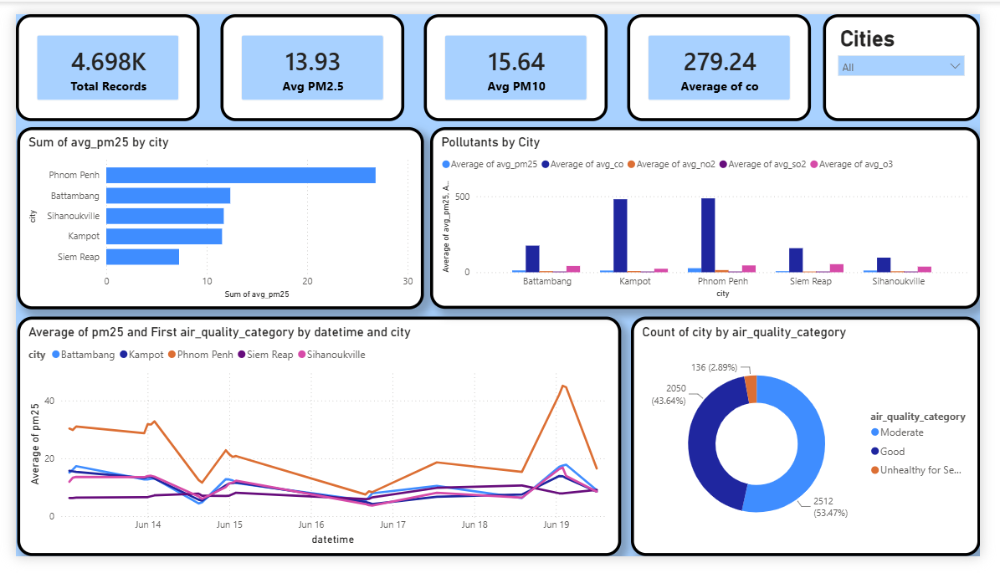

# Cambodia Air Quality Analysis Pipeline

##  Dashboard Preview



A real-time air quality data pipeline for 5 Cambodian cities. Fetches live readings from the Open-Meteo API every 60 seconds, processes them with Apache Spark, and stores results in SQL Server.

---

## Architecture

```
Open-Meteo API
      │
      ▼
api_to_csv.ipynb          ← polls API every 60s, appends rows to CSV
      │
      ▼
live_input/air_quality_combined.csv
      │
      ▼
air_quality_pipeline.ipynb  ← Spark cleans, aggregates, and writes to SQL Server
      │
      ▼
SQL Server (AirQualityDB)
  ├── CleanedAirQuality
  ├── CitySummary
  ├── PollutantAvg
  ├── CategoryDistribution
  ├── DangerousAirQuality
  └── LatestCityAirQuality
```

**Cities monitored:** Phnom Penh · Siem Reap · Battambang · Kampot · Sihanoukville

---

## Prerequisites

| Tool | Version |
|------|---------|
| Python | 3.9+ |
| Java (JDK) | 17 |
| Apache Spark | 4.x |
| SQL Server | any (local instance) |
| ODBC Driver | 17 for SQL Server |

---

## Setup

### 1. Install Python dependencies

```bash
pip install requests pandas pyspark sqlalchemy pyodbc
```

### 2. Set up the database

Run [setup.sql](setup.sql) in SQL Server Management Studio or `sqlcmd`:

```bash
sqlcmd -S (local)\MSSQLSERVER01 -E -i setup.sql
```

This creates the `AirQualityDB` database, the `airuser` login, and all 6 tables.

> **Note:** After running the script, restart the SQL Server service once so mixed-mode authentication takes effect.

### 3. Configure Java home

The pipeline notebook sets `JAVA_HOME` automatically:

```python
os.environ["JAVA_HOME"] = r"C:\Program Files\Java\jdk-17"
```

Update this path if your JDK is installed elsewhere.

---

## Running the Pipeline

Run both notebooks in parallel (two separate Jupyter kernels):

### Step 1 — Start the data collector

Open `api_to_csv.ipynb` and run all cells. It polls the API every 60 seconds and appends rows to `live_input/air_quality_combined.csv`.

```
[20260619_035000] Fetching data...
  ✓ Phnom Penh     AQI=42  PM2.5=10.2
  ✓ Siem Reap      AQI=38  PM2.5=8.7
  ✓ Battambang     AQI=35  PM2.5=7.9
  ✓ Kampot         AQI=29  PM2.5=6.1
  ✓ Sihanoukville  AQI=31  PM2.5=6.8
  → Appended 5 rows to air_quality_combined.csv
  → Total rows in file: 4669
  Waiting 60s...
```

### Step 2 — Start the Spark processor

Open `air_quality_pipeline.ipynb` and run all cells. It reads the CSV, cleans the data, runs aggregations, and writes results to SQL Server every 60 seconds.

```
[Batch 1] 2026-06-19 03:50:38
  Raw rows:   4669
  Clean rows: 4669

  Saving → dbo.CleanedAirQuality   
  Saving → dbo.CitySummary         
  Saving → dbo.PollutantAvg        
  Saving → dbo.DangerousAirQuality 
  Batch 1 completed successfully
  Waiting 60 seconds...
```

---

## Data Cleaning

The `clean()` function in `air_quality_pipeline.ipynb` applies these steps to every batch:

```python
# Cast pollutant columns to float
for col in ["aqi", "pm25", "pm10", "co", "no2", "so2", "o3"]:
    df = df.withColumn(col, F.col(col).cast(DoubleType()))

# Parse ISO datetime string
df = df.withColumn("datetime", F.to_timestamp("datetime", "yyyy-MM-dd'T'HH:mm"))

# Drop rows with missing PM2.5 or datetime
df = df.filter(F.col("pm25").isNotNull())
df = df.filter(F.col("datetime").isNotNull())

# Drop negative sensor readings
df = df.filter((F.col("pm25") >= 0) & (F.col("pm10") >= 0) & (F.col("aqi") >= 0))

# Derive time columns
df = df.withColumn("date",  F.to_date("datetime"))
df = df.withColumn("hour",  F.hour("datetime"))
df = df.withColumn("month", F.month("datetime"))
```

### AQI Category Classification (PM2.5-based)

| PM2.5 (µg/m³) | Category |
|---------------|----------|
| 0 – 12.0 | Good |
| 12.1 – 35.4 | Moderate |
| 35.5 – 55.4 | Unhealthy for Sensitive Groups |
| 55.5 – 150.4 | Unhealthy |
| 150.5 – 250.4 | Very Unhealthy |
| > 250.4 | Hazardous |

---

## Database Schema

### `CleanedAirQuality` — raw cleaned records

```sql
CREATE TABLE dbo.CleanedAirQuality (
    id                    INT IDENTITY(1,1) PRIMARY KEY,
    city                  NVARCHAR(100),
    latitude              FLOAT,
    longitude             FLOAT,
    datetime              DATETIME2,
    aqi                   FLOAT,
    pm25                  FLOAT,
    pm10                  FLOAT,
    co                    FLOAT,
    no2                   FLOAT,
    so2                   FLOAT,
    o3                    FLOAT,
    created_at            DATETIME2,
    date                  DATE,
    hour                  INT,
    month                 INT,
    air_quality_category  NVARCHAR(100)
);
```

### `CitySummary` — PM2.5 summary per city

```sql
CREATE TABLE dbo.CitySummary (
    city           NVARCHAR(100),
    avg_pm25       FLOAT,
    max_pm25       FLOAT,
    total_records  INT
);
```

### `PollutantAvg` — average of all pollutants per city

```sql
CREATE TABLE dbo.PollutantAvg (
    city      NVARCHAR(100),
    avg_pm25  FLOAT,
    avg_pm10  FLOAT,
    avg_co    FLOAT,
    avg_no2   FLOAT,
    avg_so2   FLOAT,
    avg_o3    FLOAT
);
```

### `DangerousAirQuality` — count of Unhealthy/Very Unhealthy/Hazardous readings

```sql
CREATE TABLE dbo.DangerousAirQuality (
    city                  NVARCHAR(100),
    air_quality_category  NVARCHAR(100),
    dangerous_count       INT
);
```

---

## Project Structure

```
Air Quality Analysis Pipeline/
├── api_to_csv.ipynb              # Stage 1: API poller → CSV
├── air_quality_pipeline.ipynb    # Stage 2: Spark processor → SQL Server
├── setup.sql                     # One-time DB + table creation script
├── mssql-jdbc-13.4.0.jre11.jar  # JDBC driver for Spark ↔ SQL Server
├── live_input/
│   └── air_quality_combined.csv  # Growing CSV written by Stage 1
└── README.md
```

---

## SQL Server Connection

Both notebooks connect to:

```
Server:   (local)\MSSQLSERVER01
Database: AirQualityDB
User:     airuser
Password: Air@12345
```

To change the target instance, update the connection string in `air_quality_pipeline.ipynb`:

```python
conn_str = (
    "DRIVER={ODBC Driver 17 for SQL Server};"
    "SERVER=(local)\\MSSQLSERVER01;"   # ← update this
    "DATABASE=AirQualityDB;"
    "UID=airuser;"
    "PWD=Air@12345;"
    "TrustServerCertificate=yes;"
)
```
